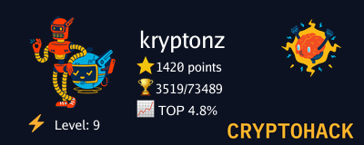

  

---
# About me

- 🌱 My name is Kourosh
- 📖 I'm currently self-studying cryptography and related mathematics.
- 🏆 I'm a CTF player at [Pr1m3d](https://github.com/Pr1m3dCTF) Team (I usually solve crypto/web/misc/ppc challenges)
- 👯 I'm looking for opportunities to collaborate in cryptography-related research (paper, blog post)
- 🥷 I also like to create content related to cybersecurity (CTF challenges and [writeups](https://pr1m3dctf.github.io/writeups/))
- 💻 BTW I Use Arch Linux!
- 💬 Ask me about why Demon Slayer is the best anime!
- 📫 How to reach me: Pr1m3d_0x17@proton.me
---

<!--
---
 # Statistics
 

KooroshRZ/KooroshRZ is a ✨ _special_ ✨ repository because its README.md (this file) appears on your GitHub profile.

- 🌱 I’m currently Red Teaming / Cryptography / Binary Exploitation
- 👯 I’m looking to collaborate on ...
- 🤔 I’m looking for help with ...
- 💬 Ask me about ...
- 📫 How to reach me: ...
- 😄 Pronouns: ...
- ⚡️ Fun fact: ...
-->
